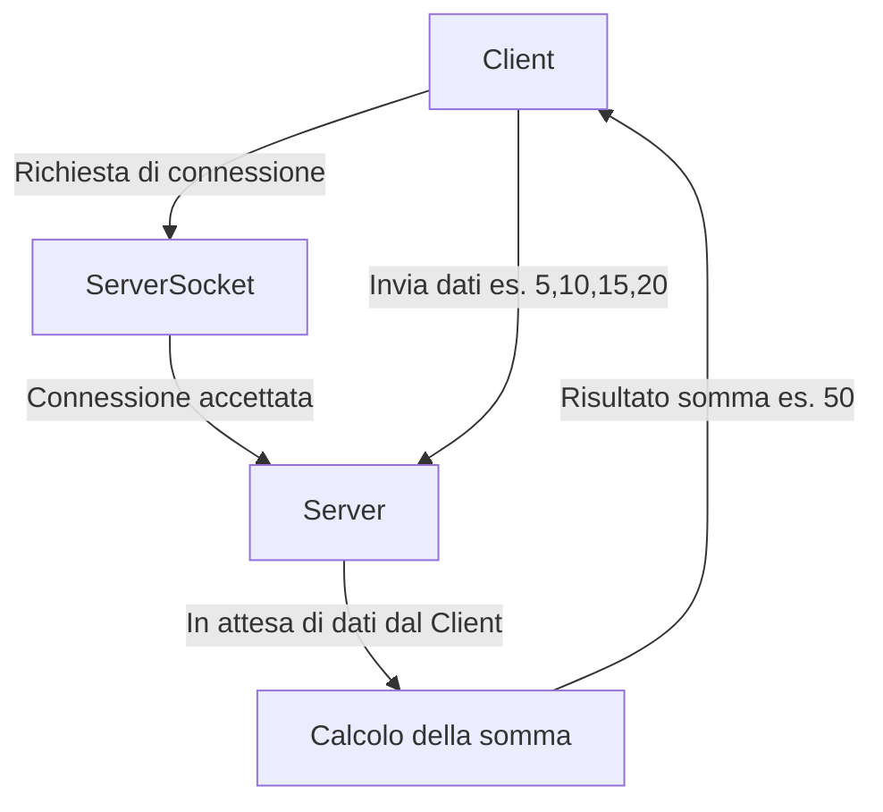

## **Domande**

#### **TEORIA**
1. Nel codice del server, perché si utilizza un oggetto `ServerSocket` per creare la connessione e qual è il ruolo del metodo `accept()` in questo contesto?  

2. Che cosa accade se più client tentano di connettersi contemporaneamente al server?  
   Il codice attuale è in grado di gestire questa situazione?

3. Cosa accade se il client tenta di connettersi a un server che non è in esecuzione o è irraggiungibile?  
   Come viene gestito questo scenario nel codice?

---

## **Risposte**

### 1. **Perché si utilizza un oggetto ServerSocket?**

Un oggetto `ServerSocket` è essenziale per:  
- Ascoltare le richieste in arrivo su una porta specifica.  
- Stabilire connessioni con i client, creando un oggetto `Socket` dedicato a ciascun client.  

Esempio di utilizzo:  
```java
ServerSocket serverSocket = new ServerSocket(9999); // Avvia il server sulla porta 9999
```

### 2. **Qual è il ruolo del metodo accept()?**

Il metodo `accept()`:  
- Blocca l'esecuzione del server fino a quando un client richiede una connessione.  
- Restituisce un oggetto `Socket` per comunicare con il client.  

Esempio:  
```java
Socket socket = serverSocket.accept(); // Attende e accetta una connessione
System.out.println("Connessione accettata da: " + socket.getInetAddress());
```

### 3. **Cosa accade se più client si connettono contemporaneamente?**

Nel codice attuale, il server accetta **una connessione alla volta**. Per gestire più client contemporaneamente, è necessario utilizzare i thread o un thread pool.  

**Modifica del codice per gestire più client:**
```java
while (true) {
    Socket socket = serverSocket.accept(); // Accetta un client
    new Thread(() -> handleClient(socket)).start(); // Gestisce ogni client in un thread separato
}

private static void handleClient(Socket socket) {
    try {
        BufferedReader reader = new BufferedReader(new InputStreamReader(socket.getInputStream()));
        PrintWriter writer = new PrintWriter(new OutputStreamWriter(socket.getOutputStream()), true);

        String input = reader.readLine();
        System.out.println("Ricevuto dal client: " + input);

        // Calcolo della somma
        int somma = Arrays.stream(input.split(","))
                          .mapToInt(Integer::parseInt)
                          .sum();

        writer.println(somma); // Invia il risultato al client
        System.out.println("Risultato inviato: " + somma);

    } catch (Exception e) {
        System.err.println("Errore durante la gestione del client: " + e.getMessage());
    }
}
```

#### 4. **Cosa accade se il client tenta di connettersi a un server non attivo?**

Se il server non è in esecuzione o non è raggiungibile:  
- Il client genera un'eccezione `IOException`.  
- Questo può essere gestito mostrando un messaggio di errore all'utente.  

**Codice del client con gestione degli errori:**
```java
try (Socket socket = new Socket("localhost", 9999)) {
    System.out.println("Connessione al server stabilita!");
    // Operazioni di lettura/scrittura...
} catch (IOException e) {
    System.err.println("Errore di connessione: il server potrebbe non essere attivo.");
}
```

---

### **Diagramma di flusso**


---

